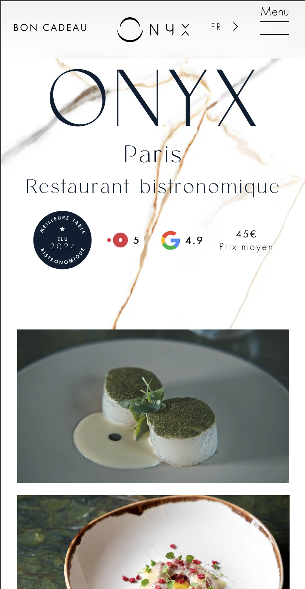
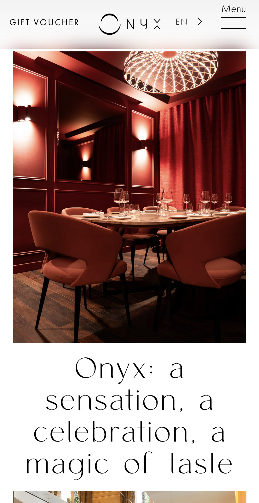
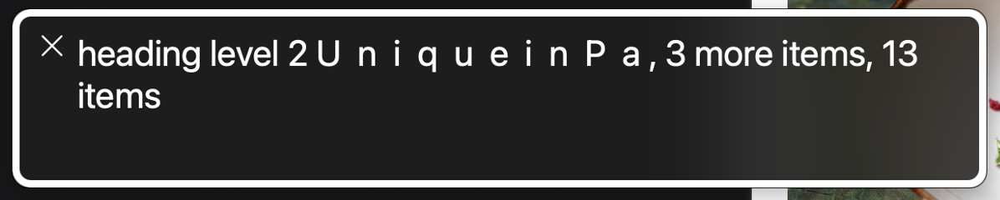
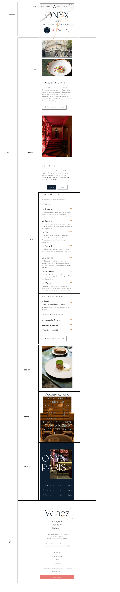
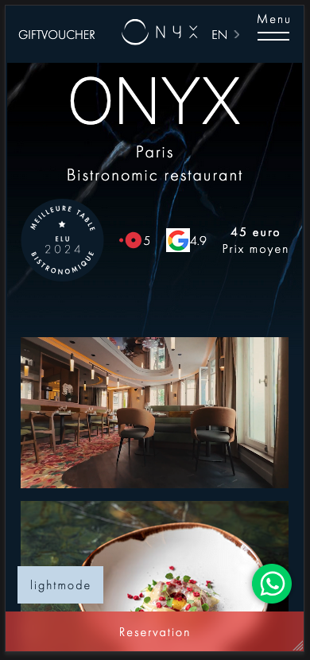
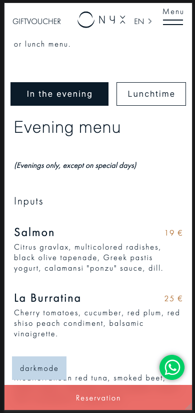
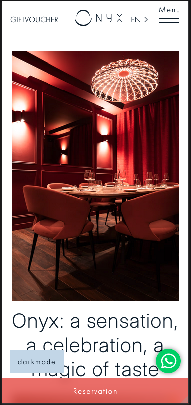
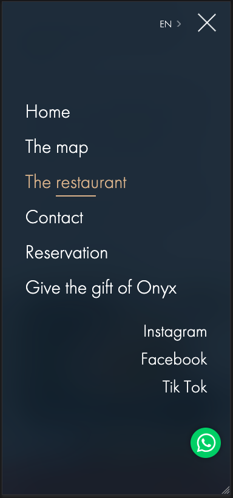
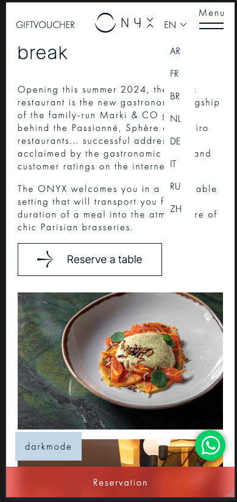

# Procesverslag
Markdown is een simpele manier om HTML te schrijven.  
Markdown cheat cheet: [Hulp bij het schrijven van Markdown](https://github.com/adam-p/markdown-here/wiki/Markdown-Cheatsheet).

Nb. De standaardstructuur en de spartaanse opmaak van de README.md zijn helemaal prima. Het gaat om de inhoud van je procesverslag. Besteedt de tijd voor pracht en praal aan je website.

Nb. Door *open* toe te voegen aan een *details* element kun je deze standaard open zetten. Fijn om dat steeds voor de relevante stuk(ken) te doen.

## Jij

  
uitwerken voor kick-off werkgroep

  ### Auteur:
  Thijn Glas

  #### Je startniveau:
  rood

  #### Je focus:
  surface plane
 

## Je website

  
uitwerken voor kick-off werkgroep

  ### Je opdracht:
  [link naar de website die je gaat namaken óf de naam/omschrijving van je eigen ontwerp](https://restaurantonyx.com/)

  #### Screenshot(s) van de eerste pagina (small screen): 
  restaurant Onyx homepagina
  

  #### Screenshot(s) van de tweede pagina (small screen):
  restaurant Onyx restaurant pagina  
  
 

## Toegankelijkheidstest 1/2 (week 1)

  
uitwerken na test in 2e werkgroep

  ### Bevindingen
  Tijdens de les over toegankelijkheid hebben we gebruik gemaakt van verschillende spullen om te kunnen mee maken hoe mensen met een bepaalde “handicap”.
  
  We hebben verschillende brillen opgehad en met een elektriciteit gevend apparaat “spasms” meegemaakt.
  
  Daarna zijn we bezig geweest met voiceover gebruiken, naast dat het erg lastig te navigeren was waren er ook een aantal problemen met de website zoals dat sommige text gezien werd als verschillende letters inplaats van 1 woord.
    

## Breakdownschets (week 1)

  
uitwerken na afloop 3e werkgroep

  ### de hele pagina: 
  

  ### dynamisch deel (bijv menu): 
  

  ### wellicht nog een dynamisch deel (bijv filter): 
  <a href="https://www.figma.com/design/H5e4mgDRC4DsGSExlGaE3j/breakdown-sketch?node-id=0-1&t=6paqE9zHmKUpMiIn-1">link naar breakdown schets</a>

## Voortgang 1 (week 2)

  
uitwerken voor 1e voortgang

  ### Stand van zaken
  Het maken van de html ging erg goed, dit aangezien ik al veel ervaring heb met html. Voor het gesprek had ik 1 van de 2 pagina's gemaakt in alleen html.

  ### Agenda voor meeting
  samen met je groepje opstellen

  Ik heb niet echt vragen voor het gesprek, dit omdat ik nog niet heel ver was gekomen met de pagina.

  ### Verslag van meeting
  hier na afloop snel de uitkomsten van de meeting vastleggen

  - headings gebruiken voor sections
  - spans ipv div bij bepaald gedeelte

## Voortgang 2 (week 3)

  
uitwerken voor 2e voortgang

  ### Stand van zaken
  Ik ben klaar met pagina 1 met css volledig en bijna klaar met pagina 2. 

  ### Agenda voor meeting

  Ik heb geen vragen want ben nog lekker bezig met het maken van de websites, het gaat goed met het maken.

  ### Verslag van meeting
  hier na afloop snel de uitkomsten van de meeting vastleggen

  - articles moeten ook een heading hebben net als sections.

## Toegankelijkheidstest 2/2 (week 4)

  
uitwerken na test in 9e werkgroep

  
  
  
  
  

  ### Bevindingen
  Lijst met je bevindingen die in de test naar voren kwamen (geef ook aan wat er verbeterd is):
  - Het testen ging goed, wanneer ik een screenreader gebruik heb ik nu ook hun heading probleem opgelost. Zij hebben dit zo aangezien ze de teksten letter voor letter willen in laten animeren.
  - Verder heb ik ervoor gesorgd dat de video nu wel pauzeren en deze start niet automatisch.
  - Mijn validator geeft bij de svg's een error aangezien deze door hun inlijn gestyled zijn met een width en height.
  - Verder geeft de validator ook een error bij teksten die in spans staan, de student assistent zei dat ik in mijn html spans moest gebruiken inplaats van div's omdat dat bij dit vak niet mag maar online staat de oplossing dat ik het in een div moet zetten inplaatsvan een span.

## Voortgang 3 (week 4)

  
uitwerken voor 3e voortgang

  ### Stand van zaken
  

  ### Agenda voor meeting
  vragen:
  Waar kan ik de heading invisibility vinden?
  hoe kan ik de menu kruisje krijgen?
  video controls werken niet met touchscreen
  mag de svg inline gestijlt zijn?
  is animatie genoeg gedaan en micro interactie?

  

  ### Verslag van meeting
  - al mijn vragen zijn beantwoord, ik moet testen op mobiel of de controls dan wel werken, dit doen ze.
  - de heading invisibilty css heb ik nu gevonden.
  - Ik had gevraagd of ik perse de menu knop tot kruis moet animeren, dit moest dus daar ben ik verder mee gegaan.
  - de svg mocht niet inline gestijld zijn dit heb ik dus aangepast.
  

## Eindgesprek (week 5)

  
uitwerken voor eindgesprek

  ### Je uitkomst - karakteristiek screenshots:
  
    
      

  ### Dit ging goed/Heb ik geleerd: 
  Korte omschrijving met plaatjes
  Ik heb geleerd een nette pagina te maken met html css en js, deze pagina heeft een hamburger menu met een geanimeerde knop.
  

Verder heeft de website nog een dropdown menu voor talen. 
  

  Ook heb ik de menu items geanimeerd doormiddel van de javascript IntersectionObserver. Daarnaast werkt het menu ook, als je op de lunch button klikt krijg je de lunch items en andersom ook natuurlijk.
  

 En als laatste Surface plane heb ik een dark mode gemaakt, deze dark mode reageert ook op de voorkeuren van je systeem.
  

  ### Dit was lastig/Is niet gelukt:
  Het meeste wat ik wilde maken is me gelukt, het enige jammer vind ik wel dat ik erg veel tijd heb gestoken in de dark mode. Ik had verwacht dat dit iets sneller ging dan verwacht maar aangezien die mogelijkheid nog erg nieuw is (zoals Danny al had gezegd) was er nog niet heel veel informatie om te researchen. 

## Bronnenlijst

  
continu bijhouden terwijl je werkt

  1. bron: https://www.a11yproject.com/posts/how-to-hide-content/
  2. bron: https://codepen.io/daltonw/pen/YzpbWvW?editors=1010
  3. 

